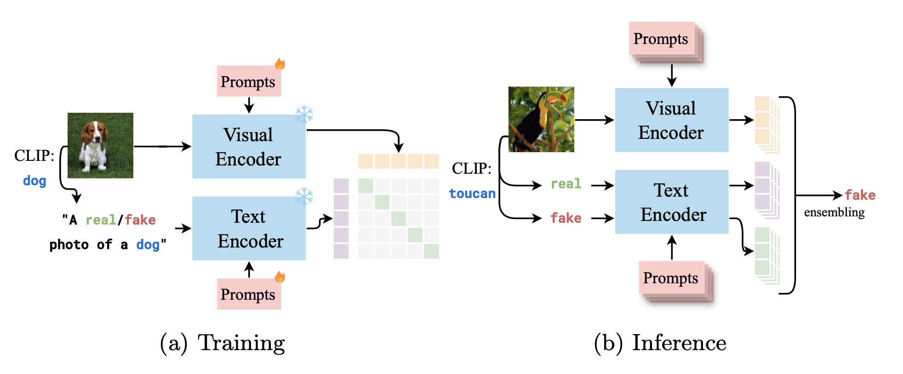

<div align="center">
    <a href="https://www.python.org"></a>
    <a href="https://pytorch.org/get-started/locally/"></a>
    <a href="https://wandb.ai/site"></a>
    <a href="https://github.com/psf/black"></a>
    <h1 align="center">✋ Prompt2Guard: Conditioned Prompt-Optimization for Continual Deepfake Detection</h1>
    <h4 align="center">Francesco Laiti, Benedetta Liberatori, Thomas De Min, Elisa Ricci</h4>
    <p align="center"> 
    </p>
</div>

<div align="center">
    <a href=#abstract>Abstract</a>
    •
    <a href=#setup>Setup</a>
    •
    <a href=#preparing-dataset>Dataset</a>
    •
    <a href=#training >Training</a>
    •
    <a href=#evaluation >Evaluation</a>
    •
    <a href=#citation >Citation</a>
</div>
<br>

PyTorch implementation for ICPR 2024 paper [**"Conditioned Prompt-Optimization for Continual Deepfake Detection"**](./). :star2: this repo!

<p align="center">
  
</p>

## Abstract
The rapid advancement of generative models has significantly enhanced the realism and customization of digital content creation. The increasing power of these tools, coupled with their ease of access, fuels the creation of photorealistic fake content, termed deepfakes, that raises substantial concerns about their potential misuse. In response, there has been notable progress in developing detection mechanisms to identify content produced by these advanced systems. 

However, existing methods often struggle to adapt to the continuously evolving landscape of deepfake generation. This paper introduces Prompt2Guard, a novel solution for exemplar-free continual deepfake detection of images, that leverages Vision-Language Models (VLMs) and domain-specific multimodal prompts. Compared to previous VLM-based approaches that are either bounded by prompt selection accuracy or necessitate multiple forward passes, we leverage a prediction ensembling technique with read-only prompts. Read-only prompts do not interact with VLMs internal representation, mitigating the need for multiple forward passes. Thus, we enhance efficiency and accuracy in detecting generated content. Additionally, our method exploits a text-prompt conditioning tailored to deepfake detection, which we demonstrate is beneficial in our setting. 

We evaluate Prompt2Guard on CDDB-Hard, a continual deepfake detection benchmark composed of five deepfake detection datasets spanning multiple domains and generators, achieving a new state-of-the-art. Additionally, our results underscore the effectiveness of our approach in addressing the challenges posed by continual deepfake detection, paving the way for more robust and adaptable solutions in deepfake detection.


## Setup
Create the virtual Python environment for Prompt2Guard using the provided requirements file to replicate our dev env:

```
python3.9 -m venv prompt2guard
source prompt2guard/bin/activate
pip install -r requirements.txt
```
> Tested on Python 3.9, PyTorch 2.1.0, CUDA 12.1 and 1x NVIDIA GPU A30 (24 GB memory)

## Preparing Dataset
1. Download the CDDB dataset. [Project page](https://coral79.github.io/CDDB_web/) | [Direct GDrive link](https://drive.google.com/file/d/1NgB8ytBMFBFwyXJQvdVT_yek1EaaEHrg/view)  

2. Unzip the downloaded file wherever you want to store it, and you should have the following folders structure:
    ```
    CDDB
    ├── biggan
    │   ├── train
    │   └── val
    ├── gaugan
    │   ├── train
    │   └── val
    ├── san
    │   ├── train
    │   └── val
    ├── whichfaceisreal
    │   ├── train
    │   └── val
    ├── wild
    │   ├── train
    │   └── val
    ... ...
    ```

3. We already provide [classes.pkl](src/utils/classes.pkl) file available in [utils](./src/utils/) subfolder. This file contains the top5 classes and their respective scores obtained from the zero-shot classification step of the above dataset, divided into human and object categories. If you need more classes or you want to use a different datasets, run [zeroshot_classprediction.py](./src/utils/zeroshot_classprediction.py) script and change it accordingly to your dataset properties. 
    > Check [utils/data_manager.py#L174](https://github.com/laitifranz/Prompt2Guard/blob/main/src/utils/data_manager.py#L174) and [eval.py#L78](https://github.com/laitifranz/Prompt2Guard/blob/main/src/eval.py#L80) to change the object classes file path.

## Pretrained Models
A set of weights of pretrained models is available in [checkpoints](./checkpoints) folder. Thanks to the prompt learning approach, we reduce the memory footprint by storing small amounts of parameters. Consider that a set of trained parameters, excluding the backbone CLIP, of our best configuration model is less than 150 KB. Backbone CLIP model weights will be downloaded when launching a train or eval script, if not already cached.

## Training

Change the `data_path` in [cddb_training](./configs/cddb_training.json) config files to the location of the datasets. The provided settings are the ones used to obtain the results in the paper. Feel free to experiment!

To run the training
```
python src/train.py
```
> WandB is available to track metrics. Set project names, entity and other options in [prompt2guard.py#L72-L74](https://github.com/laitifranz/Prompt2Guard/blob/main/src/methods/prompt2guard.py#L72-L74) and, when executing the project, run ``python src/train.py --wandb`` to enable it.

> "ensembling" option in [cddb_training](./configs/cddb_training.json) refers to the ensembling done on object classes. It is a list of true/false that represent where to apply the ensembling at different level of the method, not the prediction ensembling (available at the inference step), and they are respectively at level: Token Embedding, Before the Cosine Similarity function, After the Cosine Similarity function, use the Confidence Scores from the object classes. The default option applies the emsembling after computing the cosine similarity of CLIP without using the confidence scores, respectively: ``[False, False, True, False]``.

## Evaluation
Change the `data_path` in [cddb_inference](./configs/cddb_inference.json) config files to the location of the datasets. Two scenarios are available: CDDB-Hard or OOD (FaceForensic++, Glow, StarGAN, which are not used to train the model). 
- Only CDDB Hard (default)
    
    ``"scenario" : ["cddb_hard"]``
- Only OOD
    
    ``"scenario" : ["ood"]``
- Both:
    
    ``"scenario" : ["cddb_hard", "ood"]``

To reproduce the results of the paper
```
python src/eval.py --resume checkpoints/best_results.tar
```

or to reproduce the results of Prompt2Guard without text-prompt conditioning (Table 3)
```
python src/eval.py --resume checkpoints/no_textprompt_conditioning.tar
```

## Citation

Please consider citing our paper in your publications if the project helps your research.

```
@InProceedings
```

## Acknowledgments

This work is the culmination of my Master's thesis in Artificial Intelligence Systems, completed in March 2024. I would like to express my deep gratitude to Professor Elisa Ricci and PhD candidates Benedetta Liberatori and Thomas De Min for their invaluable supervision and collaboration throughout this final step of my educational journey, which has ended in the best way possible!